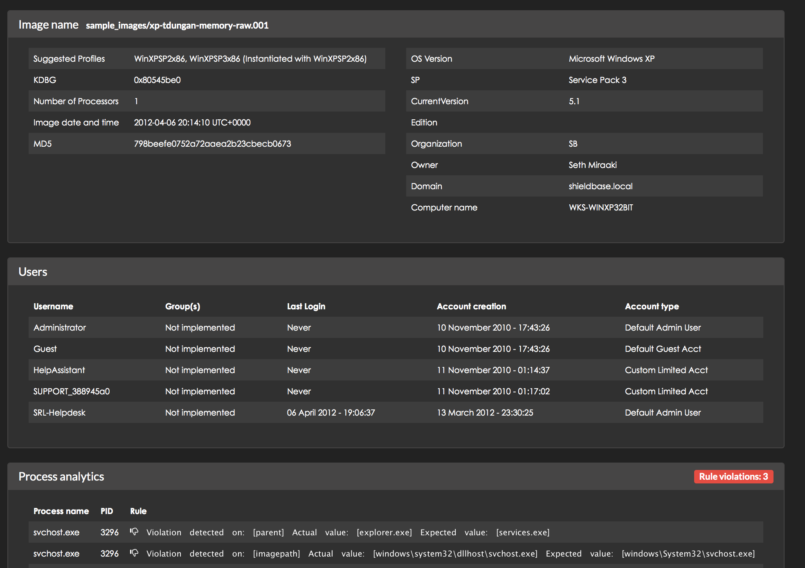

.. IRhelper documentation master file, created by
   sphinx-quickstart on Mon Mar 27 21:44:23 2017.
   You can adapt this file completely to your liking, but it should at least
   contain the root `toctree` directive.

About (work in progress)
=========================

A play POC tool for first quick analysis of memory images for fun and learning!

IRHelper is meant to be a simple tool for automating as much as possible
the tasks an analyst would perform when acquiring a memory dump. It was
inspired by the SANS Windows Forensic Analysis poster which provides steps
to perform during DFIR assuming both disk and memory dumps are available.

https://digital-forensics.sans.org/community/cheat-sheets

https://digital-forensics.sans.org/media/poster-windows-forensics-2016.pdf

* Step 01: Prep Evidence/Data Reduction

* Step 02: Anti-Virus Checks

* Step 03: Indicators of compromise search

* Step 04: Automated memory analysis

* Step 05: Evidence of persistence

* Step 06: Packing/Entropy check

* Step 07: Review event logs

* Step 08: Super timeline examination

* Step 09: By-Hand memory analysis

* Step 10: By-Hand 3rd Party Hash lookups

* Step 11: MFT Anomalies

* Step 12: File time anomalies

* Step 13: If you got malware then Hurrey !!! If not look deeper!

**IRHelper will cover for you the following steps which normally would be run By-Hand!**

* Step 09: By-Hand memory analysis

* Step 10: By-Hand 3rd Party Hash lookups

* **Bonus**: Try to extract other information which would normally be found on the disk

The Bonus part is only best effort as data might be paged so we wont have enough information
to extract what we want.

So the high level objectives of IRHelper would be:

* To extract as much information as possible from a memory dump and present it to the user in well presented/readable format

* To enable even novice users to be able to use it and extend it

* Learn while you play with it (Python/Memory analysis/Writing Volatility plugins)

* Integrate with other tools which can help in your decision making progress

* Focus on what matters

* Experiment with new techniques of detecting suspicious patterns

* Utilize as much as possible the existing volatility plugins

* Have fun running memory analysis!

Volatility is an amazing and very powerful tool for performing memory analysis.
However for the novice user it does come with some drawbacks.

* Has to decide which plugins to run and what information is valuable for further analysis

* Requires scripting or development/coding skills to take full advantage of it

* Difficult to keep track of the different information and where to go next

* To detect some obvious patterns or leads can take long time

* Different OS versions require from the user to know by heart many OS internals

Similar tools
-------------
* Volutility
* Evolve
* DAMM

**DAMM** is the only tool that has a similar objective to irhelper.
However it is not easy to extend unless the user knows how to write volatility
code and does not provide standard report at the end of the analysis and integrations
with 3rd party tools

IRHelper concepts
-----------------

#. *Information extraction*: IRHelper modules used to extract as much information as possible from the memory image and store them for later processing. Usually sqlite is best option.

#. *Analysers*: Analyser modules or code is used to run data analysis on the extracted information. Analysers can combine multiple information and logic to provide some results or indicators which are not readily available to the original plugin or would take multiple steps by hand to construct

Prerequisites
==================

There are some 3rd party tools which are required to run the different modules. One basic one is Volatilty. Volatility has to
be available in your path otherwise it will not be found from the modules and and you have to specify the full path. Currently
volatility 2.5 was used for the development of the current code.

Other tools are used such as:

* Exiftool
* ClamAV
* RegRipper

Install
==================
Installation is quick and easy::

    git clone https://github.com/etz69/irhelper.git
    cd irhelper
    virtualenv venv
    source dev/bin/activate
    pip install -r requirements.txt

Directory structure
===================

The directory structure of the project is as follows::

    irhelper.py
    This is the main program to execute

    vol_plugins
    Contains custom or contrib unofficial Volatilty plugins

    templates
    Contains the report template

    dump
    Directory to dump code or artifacts from memory for further analysis

    modules
    Contains all irhelper modules

    export
    This is where you will find your shiny report !

    docs
    This amazing documentation !

Usage
==================
.. literalinclude:: artifacts/usage.md

.. _running:

Run
==================

To run irhelper just point to the image you want to analyse::

    python irhelper.py --initdb --debug templates/report.html image_samples/win7-64-nfury-memory-raw.001
    DEBUG: Cleaning DB file
    No profile provided I will prompt you soldier!
    No cache, normal run

    -------------------------------------
    Gathering image initial information
    -------------------------------------

    -------------------------------------
    KDBG: 0xf80002e400a0
    DTB: 0x187000
    KUSER_SHARED_DATA: 18446734727860715520
    id: 1
    Number of Processors: 1
    KPCR for CPU 0: 18446735277665033472
    AS Layer1: AMD64PagedMemory (Kernel AS)
    Image date and time: 2012-04-06 21:28:39 UTC+0000
    Image local date and time: 2012-04-06 17:28:39 -0400
    PAE type: No PAE
    Image Type (Service Pack): 1
    Suggested Profile(s): Win7SP0x64, Win7SP1x64, Win2008R2SP0x64, Win2008R2SP1x64
    AS Layer2: FileAddressSpace (irhelper/image_samples/win7-64-nfury-memory-raw.001)
    -------------------------------------

    0) Win7SP0x64
    1) Win7SP1x64
    2) Win2008R2SP0x64
    3) Win2008R2SP1x64

Final Report
===================

Contributing - We need you !
====================================

There are different ways you can contribute

* Write documentation

* Write code

* Report bugs

Development
=======================

You can also run each module on its own while testing::

    python modules/cmds/vol_imageinfo_module.py run image_samples/win7-64-nfury-memory-raw.001 Win7SP1x64

    Python version: 2.7.10 (default, Oct 23 2015, 19:19:21)
    [GCC 4.2.1 Compatible Apple LLVM 7.0.0 (clang-700.0.59.5)]

    DEBUG: _cache: True
    DEBUG: PLUGIN_DIR: /tmp/irhelper/vol_plugins/
    DEBUG: _VOLATILITY_PROFILE: Win7SP1x64

    -------------------------------------
    Gathering image initial information
    -------------------------------------

    DEBUG: ['vol.py', '--cache', '-f', 'image_samples/win7-64-nfury-memory-raw.001', 'imageinfo', '--output=sqlite', '--output-file=results.db']
    DEBUG: Child process pid: 38001
    Volatility Foundation Volatility Framework 2.5
    {
        "status": true,
        "message": "",
        "cmd_results": {
            "KDBG": "0xf80002e400a0",
            "DTB": "0x187000",
            "KUSER_SHARED_DATA": "18446734727860715520",
            "id": 1,
            "Number of Processors": "1",
            "KPCR for CPU 0": "18446735277665033472",
            "AS Layer1": "AMD64PagedMemory (Kernel AS)",
            "Image date and time": "2012-04-06 21:28:39 UTC+0000",
            "Image local date and time": "2012-04-06 17:28:39 -0400",
            "PAE type": "No PAE",
            "Image Type (Service Pack)": "1",
            "Suggested Profile(s)": "Win7SP0x64, Win7SP1x64, Win2008R2SP0x64, Win2008R2SP1x64",
            "AS Layer2": "FileAddressSpace (/tmp/irhelper/image_samples/win7-64-nfury-memory-raw.001)"
        }
    }

Logging
-------

For logging purposes there are two methods used::

    debug()
    err()
    print_header()

And the standard print!

Database
--------

New module development
------------------------

Edit cmd_processor.py and add your module as a method in the Modules() class.

Research
=========

Step 1: Prep evidence and data reduction
-----------------------------------------

action: Hash lists from NSRL
description: Download known MD5 hashes from NSRL for minimizing the false positives
https://www.nsrl.nist.gov/Downloads.htm
http://nsrlquery.sourceforge.net
references: -
feature: -

Step 2: AV Checks
------------------------

action: Run AV scans
description: Run AV scan on extracted executables and dlls
references: -
feature: -

Step 3: IOC search
------------------------

https://github.com/Yara-Rules/rules
https://malwareconfig.com/stats/

Step 4: Automated memory analysis
---------------------------------

Step 06: Packing/Entropy check
---------------------------------

**action:** Calculate the density (entropy) of specific filetypes (exe and dll)

**description:** Files with low entropy than normal (what is normal?) may be packed executables
which may lead you to potential malware on the system. The tool we select to carry out
the scan is DensityScout! We will also try standard entropy with python implementation (slower)
and slightly different than DensityScout and other approaches to detect packing
Most likely files with "entropy" less than 0.1 (DensityScout) we can bring to the attention of the analyst.
However in a default Windows installation we can see that there several legitimate files
below 0.1 . This technique is likely to produce false positives.Here we can use outliers

**references:**

* https://www.cert.at/downloads/software/densityscout_en.html
* https://github.com/bridgeythegeek/regentropy
* https://github.com/dchad/malware-detection

**feature:** Packing entropy information of extracted files

.. toctree::
   :maxdepth: 2
   :caption: Contents:

Indices and tables
==================

* :ref:`genindex`
* :ref:`modindex`
* :ref:`search`

Module documentation
====================

.. automodule:: modules.cmd_processor
.. autoclass:: Modules
    :members:

.. automodule:: modules.db.ops
.. autoclass:: DBOps
    :members:
